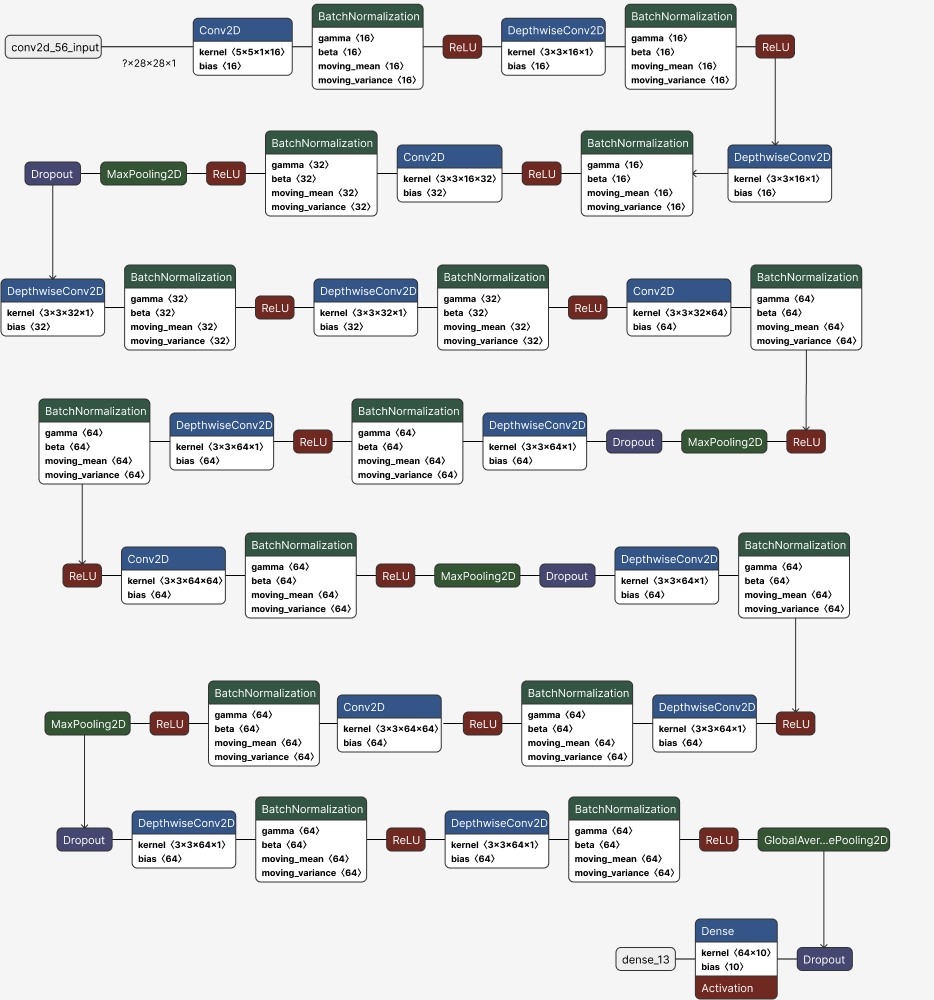

# Sveltnet: An accurate lightweight Sequential CNN model
The Sveltnet model aims to achieve the competent accuracy figures of common CNN models while being much smaller parameter-wise. By only utilizing a sum of around 100k trainable and non trainable parameters we manage to achieve similar accuracy to the much bigger and now historical [AlexNet model](https://github.com/paniabhisek/AlexNet) with ~57M parameters.<br>
This repository holds the testing results of a model on various known datasets. These include:
- [The MNIST dataset](https://www.kaggle.com/datasets/hojjatk/mnist-dataset)
- [The fashion MNIST dataset](https://www.kaggle.com/datasets/zalando-research/fashionmnist)
- [The EMNIST dataset](https://www.nist.gov/itl/products-and-services/emnist-dataset)
- [The CIFAR10 dataset](https://www.cs.toronto.edu/~kriz/cifar.html)

The model we used has the following architecture:



The AI model is written in Python using the [TensorFlow library](https://www.tensorflow.org/).<br>

## SveltNet's performance on common datasets 

The testing results of the model are:

| Test dataset       | Accuracy    | Loss   | Precision | Recall  |
|--------------------|-------------|--------|-----------|---------|
| MNIST              | 99.63%      | 0.5359 | 99.72%    | 99.47%  |
| fashion MNIST      | 89.45%      | 0.7564 | 92%       | 86.93%  |
| EMNIST             | 85.68%      | 1.109  | 88.72%    | 81.63%  |
| CIFAR10            | 79.94%      | 0.9675 | 89.69%    | 68.22%  |

## Useful information
- This project features an AI model through a web application, available [HERE](https://letter-recognition-1.onrender.com/)
- Below is given a rough guide on how to run either the training environment or the showcase app, similar to the web application, locally.
- If you wish to use SveltNet for any project use the citation provided in the Authors section from this repository.

### Prerequisites (model training environment)
In order to run the training environment, or run the showcase app you will need to have the required libraries installed. If you want to train the model a modern GPU is strongly recommended. We provide a ready environment tailored for Cuda 11.2 . In order to install the environment follow the next steps:<br>
1. Clone the repository:
```sh
git clone https://github.com/NicKylis/SveltNet.git
```
2. Install the environment using:
```sh
conda env create -f environment.yaml
```
3. For running only the showcase app:
```sh
pip install -r app_requirements.txt
```
Alternatively, you can use the Google Colab if you do not have sufficient hardware.

## Authors
Kylintireas Nikolaos, Lourmpakis Evangelos, Toramanidou Christodouli

If you need to cite SveltNet, use the following text:

N. Kylintireas, E. Lourmpakis, C. Toramanidou. (2025). Lightweight Single Model CNN (SveltNet CNN). Github. Retrieved from https://github.com/NicKylis/SveltNet/

## License

This project is licensed under the MIT License - see the [LICENSE](LICENSE) file for details.
